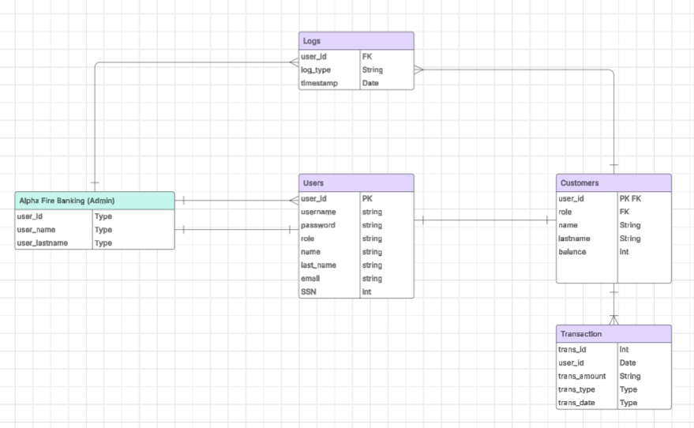

# DATABASE_PROJECT
For CSCI 3268 & CSCI_6623_81 Database Systems 

## SQL Injection Detection / Access Control System

Database dealing with Banks (ex. BofA, Chase, Capital One)

#### Project Includes:
•	Database system that simulates SQL injection attacks and implement security measures to detect them.
•	Front-end: A basic web application (HTML/CSS/JS, Python Flask).
•   Back-end: Oracle SQL, Docker
•	Store logs of SQL queries to detect possible attacks such as: Log in failures, MFA failures, and SQL Injections
•   Prevention of unauthorized access includes the blocking of accounts to log in after 5 attempts have been made.
•   Includes MFA of a pin for Admins, create a extra layer of security 
•   Admins are able to view Logs of suspicous activites, while users only have access to their bank accounts. 

#### Problem Statement: 
Many web applications are vulnerable to SQL Injection attacks, where an attacker manipulates queries to gain unauthorized access.

##### typical for login bypass:

`' OR '1'='1`
`' OR 1=1 --`
`' OR '1'='1' --`
`admin'--`
`admin'#`

##### Used to cut off trailing logic:

`' -- `
`'/* `
`admin'/* `

##### Used to extract additional data:

`' UNION SELECT NULL, NULL --`
`' UNION SELECT username, password FROM users --`

#### Database Requirements
•	Entities (Tables) – Users, Customers, Admins, Transactions, Logs
•	Relationships (ERD Diagram) – 

### Problem Statement
“Our project addresses the issue of unauthorized login attempts in enterprise networks. We have created a system that logs failed login attempts and recognizes suspicious activity patterns. The database stores user roles, timestamps, and login details. Using Oracle SQL queries, we detect brute-force attacks and unauthorized access attempts. Our system will then act on after 5 attempts and block the user from access to the system”
