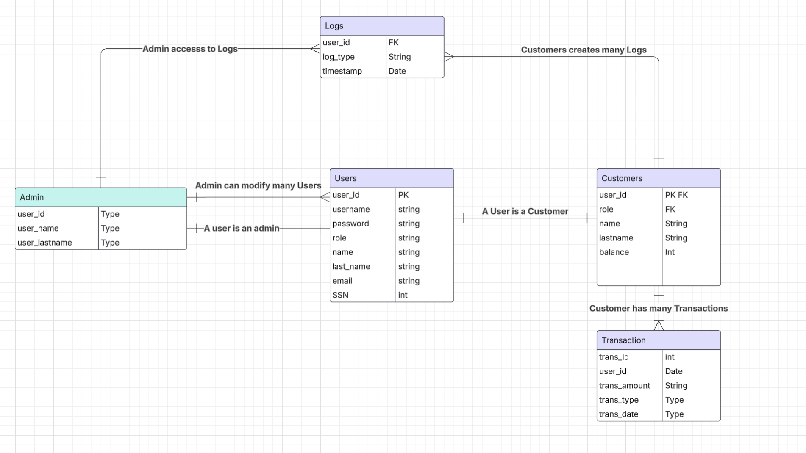

# DATABASE_PROJECT
For CSCI 3268 & CSCI_6623_81 Database Systems 

## SQL Injection Detection / Access Control System

Database dealing with Banks (ex. BofA, Chase, Capital One)

#### Project Includes:
•	Database system that simulates SQL injection attacks and implement security measures to detect them.
•	Front-end: A basic web application (HTML/CSS/JS, Python Flask).
•   Back-end: Oracle SQL, Docker
•	Store logs of SQL queries to detect possible attacks.

#### Problem Statement: 
Many web applications are vulnerable to SQL Injection attacks, where an attacker manipulates queries to gain unauthorized access.

•	SQL Use Case: Store logs of queries, analyze patterns of SQL injections, and prevent attacks with parameterized queries.
•	Dataset: Simulated attack logs or open-source SQL Injection datasets.

#### Database Requirements
•	Entities (Tables) – Users, Customers, Admins, Transactions, Logs
•	Relationships (ERD Diagram) – 

•	Queries Needed – (e.g., “Show all failed login attempts in the last 24 hours”).

### Problem Statement

💡 “Our project addresses the issue of unauthorized login attempts in enterprise networks. We have created a system that logs failed login attempts and recognizes suspicious activity patterns. The database stores user roles, timestamps, and login details. Using Oracle SQL queries, we detect brute-force attacks and unauthorized access attempts.” 💡
